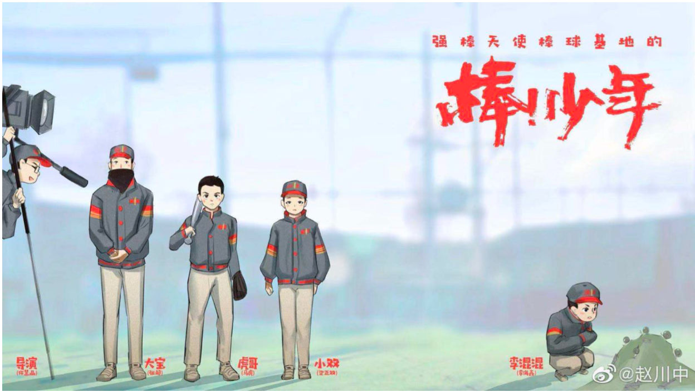
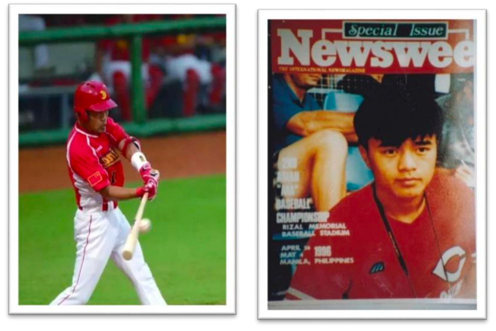

<!-- Source: [Wikipedia](https://en.wikipedia.org/wiki/Mickey_Mouse) -->

# 强棒天使项目简介

>强棒基地由前国家棒球队队长孙岭峰与爱心人士联合筹资建设，创建中国第一支公益棒球队。基地主要资助对象为全国范围内 7-10 岁困境儿童，通过专业的棒球技能获得职业发展方向和未来的就业机会。截止到 2020 年11月，项目共资助困境儿童80名，其中女孩 26名，多数儿童来自四川大凉山彝族自治州。通过基地的学习训练，她们重拾了信心也对未来建立目标，部分孩子通过努力训练走向了更大的舞台，获得了更多人的关注和认可。
2019年12月，第一批女孩入驻强棒天使基地，至今已有26名女孩，最小的6岁，最大14岁。25个来自四川大凉山的彝族姑娘。她们分别组成了U10和U12年龄组，是中国第一支女子棒球队。

    

## 项目起源

棒球是世界最受欢迎的体育运动之一，棒球运动强身益智、 崇尚礼仪，是家庭化、团队化的体育项目。每年全球有超过 20 亿 的观众观看棒球赛事。棒球世界排名前四的是日本，美国，韩国， 中国台湾，所以棒球也是最适合亚洲人的体育运动。目前，中国 棒球在世界排名约 20 左右，仍处于起步阶段，具有很大的上升 空间，并且在一二线城市已经逐渐被大家所认可。随着棒球产业 的不断发展，棒球人才的需求量将越来越大，棒球人才的未来机 遇也将前所未有。
项目主要发起人孙岭峰:从 7 岁跟随“国宝级”教练张锦 新学习棒球，与棒球相伴 30 余载。曾任国家棒球队队长 15 年， 连续三届亚洲盗垒王，国家队第一棒、当家中外野手。棒球是他 的生命。他的成长经历证明了棒球可以改变人生。中国队长的梦 想，用棒球给困境中的孩子一个重新选择未来的机会。有一天， 他将带着这些孩子一起，让中国棒球得到世界的尊重。

## 项目意义

“强棒天使项目”紧跟国家“精准扶贫”的公益战略方针， 针对 7-9 岁贫困儿童进行全面帮扶。经过多年的专业和系统的 棒球训练，完成对孩子未来的职业规划，一方面消除了社会的安 全隐患，让这些儿童能够有一技之长，得到全面的素质培养，另 一方面为中国棒球产业的发展储备并输送大量的人才。
习近平主席曾经说过:抓好教育是扶贫开发的根本大计，要 让贫困家庭的孩子都能接受公平的、有质量的教育，起码学会一 项有用的技能，不要让孩子输在起跑线上，尽力阻断贫困代际传 递。把贫困地区孩子培养出来，这才是根本的扶贫之策。
“授人以鱼不如授人以渔”，强棒天使项目通过长期投入的 方式，培养孩子棒球职业能力，在解决基本生活的同时，塑造他 们健全、独立的品格，帮助他们实现更高层次的人生目标。

    

