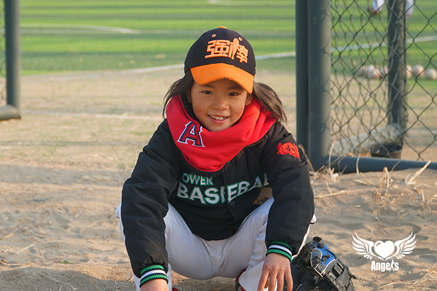

> hi你好~很高兴认识你！
我是沙马依乌，出生于2011.8.10，我是2020年9月加入强棒基地的，我的老家在四川凉山州，我是彝族，我聪明机灵，短短的发，眼眸流露灿烂的笑，活像一个日本漫画书跑出来的小可爱但她不爱训练，爱带芭比娃娃去洗澡。

    

## Questions

#### Q：什么时候开始学习棒球的？

从2020年年底开始的，已经学习三个月啦！

#### Q：每天的棒球训练时长是多久？

每天从下午13：30——17：00

#### Q：在棒球基地的一天是如何度过的，每天做喜欢做的事情？

每天6：30—7：00起床，打扫宿舍卫生，洗漱吃饭后打扫公共卫生。之后开始上课。中午午休后从13：30打棒球到17：00之后吃饭洗澡。晚上上晚自习，22：00睡觉。

    

#### 棒球学习过程中遇到过什么困难或问题？是如何克服这些问题的？

打的不好的时候就是困难...但是还是会很开心，不管打得好不好都开心。

#### Q：棒球比赛中获得的荣誉，印象最深刻的瞬间？

目前没有。

#### Q：棒球学习或比赛遇到的挫折及问题，是如何克服它们的？

目前没有。

    

#### Q：如果没有棒球，你觉得你的人生是什么样子

不知道~问题比较深奥。

#### Q：平时的兴趣爱好有哪些？

平时喜欢打棒球和画画。

#### Q：你的愿望是什么？

画画的时候问的，她说想成为一名画家。

    

